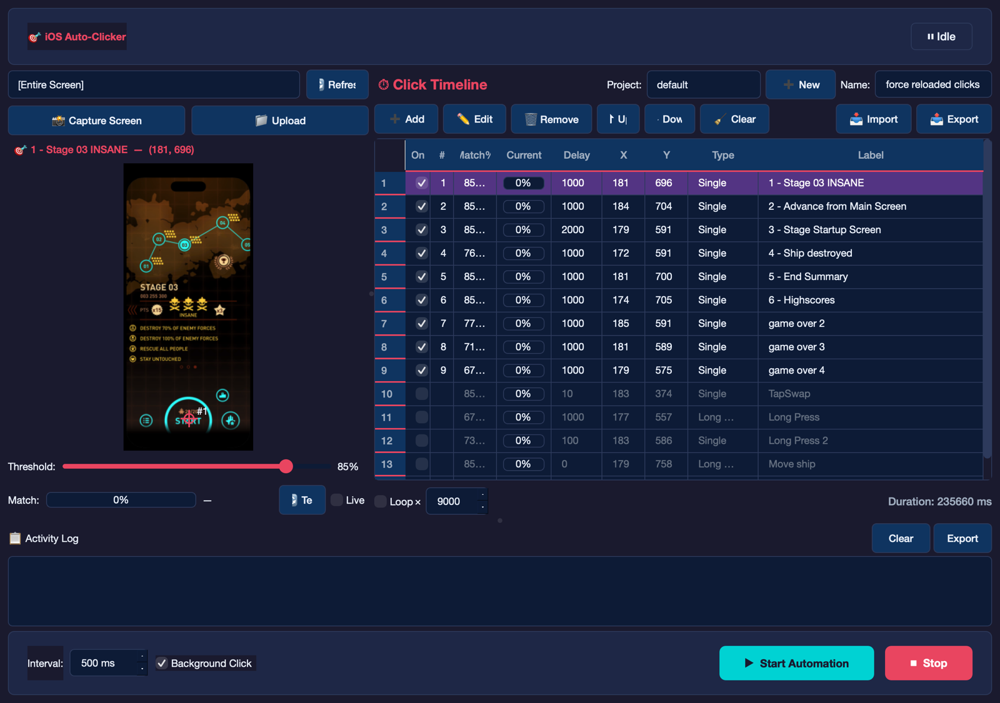

# 🎯 iOS Auto-Clicker for macOS

A macOS desktop application that automates taps on your iPhone through the **iPhone Mirroring** window. It uses **screen recognition** to detect specific screen states, then executes click actions automatically — no jailbreak required.




*The main window: target-window picker and live preview on the left, the click timeline with per-action match progress on the right, automation controls along the bottom.*

## How It Works

The app watches the iPhone Mirroring window on your Mac and compares it against reference screenshots you provide. When the screen matches a known state, it automatically clicks at the position you defined.

```
┌─────────────────────────────────────────────────────────┐
│                    Main Loop                            │
│                                                         │
│   1. Capture iPhone Mirroring window (every ~500ms)     │
│   2. Compare against ALL action screenshots (SSIM)      │
│   3. If no screenshot match → try OCR text matching     │
│   4. Best match found → wait delay → click → cooldown   │
│   5. No match → keep scanning                           │
│                                                         │
└─────────────────────────────────────────────────────────┘
```

### Screen Matching

Each click action has its **own reference screenshot** and **similarity threshold**. The app uses **SSIM (Structural Similarity Index)** to compare the current screen against each action's screenshot. This means:

- **No training needed** — just take a screenshot of the screen state you want to detect
- **Threshold control** — set how closely the screen must match (default 85%)
- **Per-action thresholds** — dynamic screens (like games) can use a lower threshold (e.g., 60-75%) while static menus keep 85%+

### Text Matching (OCR)

Actions can optionally include **text patterns** for matching. The app uses the native **macOS Vision framework** for text recognition — no external APIs or dependencies needed. Text patterns use comma-separated OR logic:

```
"game over, victory, score"  →  matches if ANY of these appear on screen
```

### Click Execution

When a match is found:
1. **Wait** the configured delay (gives the screen time to fully load)
2. **Bring** the iPhone Mirroring window to the foreground
3. **Click** at the stored (x, y) coordinates using macOS CGEvent API
4. **Cooldown** for 1 second (screen will change after clicking)

Supported click types: **Single Click**, **Double Click**, **Long Press** (configurable hold duration).

## Features

- 📸 **Per-action screenshots** — each click action has its own trigger screenshot
- 🎯 **Visual click position picker** — click on the screenshot to set coordinates
- 📊 **Real-time Match Progress** — Every action displays a live, animated progress bar showing its similarity to the current screen
- 👻 **Ghost Click (Background mode)** — Execute clicks instantly without visibly moving your mouse or stealing focus
- 📝 **OCR text matching** — fallback detection using on-screen text
- ⏯️ **Action Toggles** — Easily disable/enable specific actions in your timeline without deleting them
- 🔁 **Repeat Clicks** — Issue rapid-fire multi-clicks per single trigger match (great for games)
- ⏱️ **Infinite Long Presses** — Hold specific clicks for milliseconds to hours, safely interruptible
- 🔄 **Loop support** — repeat the sequence N times or infinitely
- 💾 **Auto-save** — all project data persists automatically between sessions
- 📤 **Import/Export** — share timelines as self-contained `.zip` packages (screenshots bundled, works across machines) or plain JSON
- 📋 **Activity log** — color-coded real-time log of all events
- 🎨 **Dark theme** — polished, modern UI

## Requirements

- **macOS 15.0+** (Sequoia) with iPhone Mirroring
- **Python 3.11+**
- **iPhone** paired for iPhone Mirroring

### macOS Permissions

The app needs two permissions (it will guide you on first launch):

| Permission | Where to Enable | Why |
|---|---|---|
| **Screen Recording** | System Settings → Privacy & Security → Screen Recording | Capture the iPhone Mirroring window content |
| **Accessibility** | System Settings → Privacy & Security → Accessibility | Send click events to the window |

> Add your **Terminal app** (or iTerm, etc.) to both permission lists.

## Running the App

```bash
git clone https://github.com/raphaelbgr/ios-autoclicker.git
cd ios-autoclicker
./run.sh
```

That's it. `run.sh` is idempotent — run it every time. It creates the virtualenv if missing, installs/updates dependencies, and launches the app.

**Before you press ▶ Start, make sure:**
1. **iPhone Mirroring is open** and showing your phone.
2. **Screen Recording** and **Accessibility** are granted (see the table above). Without Accessibility, macOS silently swallows every click — the app warns you in the activity log rather than failing quietly.

### Double-click launch

A native `iOS AutoClicker.app` bundle with a custom icon ships in the project folder — double-click it (or its Desktop alias) to launch without a terminal. Grant it Accessibility on first run if prompted.

### Manual launch

```bash
python3 -m venv .venv
source .venv/bin/activate
pip install -r requirements.txt
python -m src.main
```

### Running the tests

```bash
.venv/bin/python -m pytest tests/ -q       # 125 tests, ~3s
```

Qt is forced offscreen and the tracking stream is redirected to a temp file (see `conftest.py`), so the suite never opens a window or touches your real project data.

## Usage

### 1. Open iPhone Mirroring

Open the **iPhone Mirroring** app on your Mac. The auto-clicker will detect it automatically.

### 2. Create Click Actions

Click **➕ Add** to create a new action:

1. **Capture a screenshot** — click "📸 Capture Now" to take a snapshot of the current iPhone screen
2. **Pick click position** — click on the screenshot where you want the tap to happen
3. **Set match threshold** — how closely the screen must match (85% is good for static screens, lower for dynamic ones)
4. **Set delay** — how long to wait after matching before clicking (in ms)
5. **Add text patterns** (optional) — comma-separated text to match via OCR

### 3. Build Your Sequence

Add multiple actions for different screen states. For example, a game automation might look like:

| # | Screenshot | Action | Threshold |
|---|---|---|---|
| 1 | Main menu | Tap "Play" | 85% |
| 2 | Level select | Tap level | 85% |
| 3 | Game over screen | Tap "Collect" | 65% |
| 4 | Results screen | Tap "Continue" | 85% |
| 5 | High scores | Tap "OK" | 85% |

### 4. Start Automation

Click **▶ Start Automation**. The app will:
- Continuously capture the iPhone Mirroring window
- Compare against ALL action screenshots simultaneously
- Click the best matching action
- Log everything in the activity log

### 5. Stop

Click **⏹ Stop** or close the app. Your actions are auto-saved.

### Sharing a timeline

**📤 Export** writes a self-contained **`.zip` package** — `timeline.json` plus every reference screenshot it uses — so it works on any machine. **📥 Import** accepts that `.zip` (screenshots are extracted into the current project) or a plain `.json`.

> A JSON-only export stores **absolute** screenshot paths, so it loses its trigger screenshots on any other machine. Use the `.zip` unless you have a reason not to. Full spec: **[docs/TIMELINE_FORMAT.md](docs/TIMELINE_FORMAT.md)**.

## Architecture

```
src/
├── main.py                  # Entry point, permission checks
├── screen_capture.py        # Quartz API window capture
├── screen_recognizer.py     # SSIM + template matching
├── click_engine.py          # CGEvent click delivery
├── timeline.py              # Click action data model + serialization
├── ocr.py                   # macOS Vision framework OCR
├── project.py               # Auto-save/load project data
├── logger.py                # Timestamped activity logging
├── tracking.py              # Canonical-v1 event stream (tracks/tracks.jsonl)
└── gui/
    ├── main_window.py       # Main window + automation loop
    ├── timeline_editor.py   # Add/edit click action dialog
    ├── click_position_picker.py  # Click-on-image coordinate picker
    ├── screen_setup.py      # Window detection panel
    ├── log_viewer.py        # Color-coded log display
    └── styles.py            # Dark theme stylesheet
```

### Key Technologies

| Component | Technology | Why |
|---|---|---|
| GUI | PyQt6 | Cross-platform, polished native feel |
| Screen Recognition | OpenCV + SSIM (scikit-image) | Fast, no training needed |
| OCR | macOS Vision framework (PyObjC) | Native, no external APIs |
| Click Delivery | CGEvent (Quartz) | Standard macOS programmatic clicks |
| Window Capture | CGWindowListCreateImage (Quartz) | Low-level, reliable screen capture |

## Timeline Format

Timelines export as a self-contained **`.zip` package** (`timeline.json` + bundled screenshots) or plain JSON. Every field, both formats, and the backward-compatibility rules are documented in **[docs/TIMELINE_FORMAT.md](docs/TIMELINE_FORMAT.md)**.

## Distribution

This app **cannot** ship on the Mac App Store or TestFlight — the App Sandbox (Guideline 2.4.5(i)) forbids exactly what it does (capture another app's window, post clicks into it), and PyQt6 is GPL-3.0-only, which is incompatible with the App Store's terms. TestFlight is not a way around this: a macOS TestFlight build must be an App-Store-signed, sandboxed bundle, so it fails at upload.

The correct channel is **Developer ID + notarization** — a signed `.dmg`, no sandbox, no review, all permissions supported. Full analysis and the step-by-step path: **[docs/DISTRIBUTION.md](docs/DISTRIBUTION.md)**.

## Troubleshooting

| Problem | Solution |
|---|---|
| "No window detected" | Open the iPhone Mirroring app, then click 🔍 Detect |
| Clicks don't register | Enable Accessibility permission for your terminal |
| Black/empty capture | Enable Screen Recording permission for your terminal |
| Low match percentage | Lower the threshold or recapture the screenshot |
| OCR not working | `pyobjc-framework-Vision` should be installed automatically via `run.sh` |

## License

MIT
